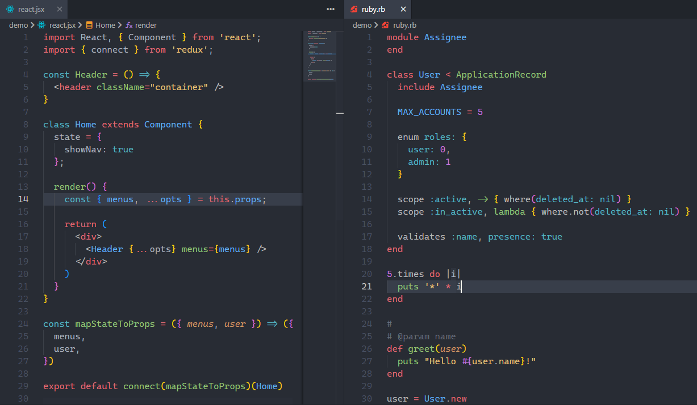

# Aki Monokai Theme
A cross between Monokai and One Dark theme.


## Install
press `ctrl/command + P` to launch quick open then run
```
ext install aki-monokai
```

## Screenshot
Screenshot of JSX and Ruby.



If you like this theme checkout [One Dark Theme](https://marketplace.visualstudio.com/items?itemName=azemoh.theme-onedark).

## Is this original?
No, this theme is forked and improved from [one-monokai](https://github.com/azemoh/vscode-one-monokai).


### Why create this fork
I really like the color scheme of the original theme, but unfortunately the original theme has not been maintained for a long time, and I happen to have some other ideas.

## Change log
You can take a look at the change log [here](https://github.com/SuiltaPico/vscode-aki-monokai/blob/master/CHANGELOG.md).